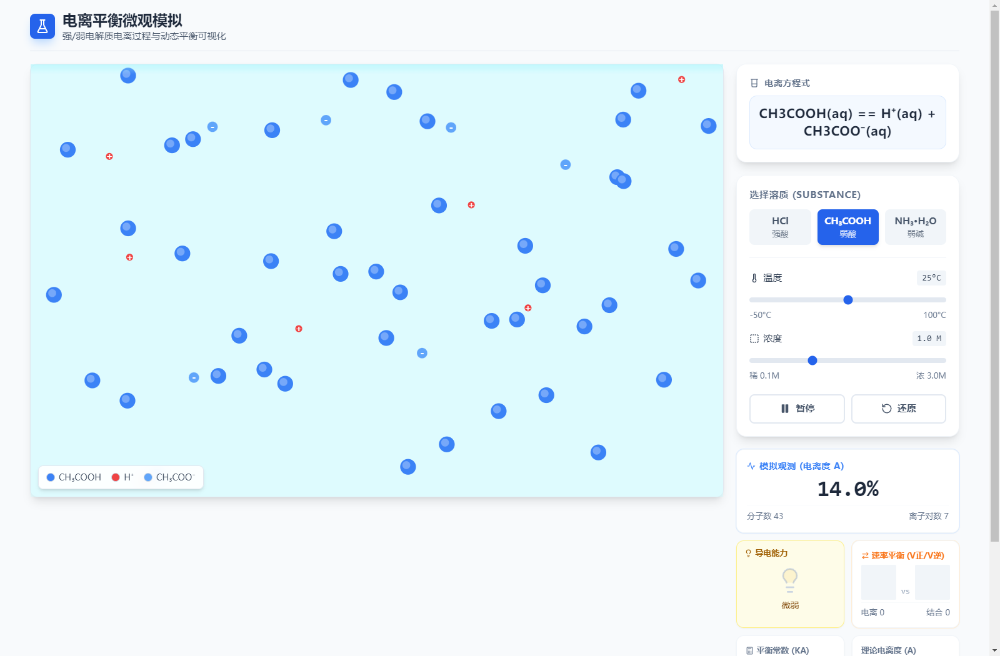

<div align="center">

# ⚗️ IonViz · 电离平衡微观模拟

**高中化学 · 弱电解质电离过程与动态平衡可视化**

把「看不见的微观粒子」变成一块可以拖滑块、可以数粒子的画布。

[](https://github.com/xmmmymm/IonViz-Simulation/actions/workflows/ci.yml)
[](LICENSE)
[](https://github.com/xmmmymm/IonViz-Simulation/releases)
[](package.json)
[](https://www.electronjs.org/)

[功能特性](#-功能特性) · [快速开始](#-快速开始) · [打包桌面端](#-打包桌面端) · [模型说明](#-模型与公式) · [项目结构](#-项目结构)

</div>

---

## 🖼 界面预览

<div align="center">



<sub>图中为 CH₃COOH（弱酸）在 25 °C / 1.0 M 下建立的动态电离平衡。左侧为粒子级模拟画布，右侧为电离方程式、控制面板与实时数据。</sub>

</div>

> 预览图由 `npm run screenshot` 从**生产构建产物**自动截取，非手工拼贴，可随时重新生成（见[重新生成预览图](#-重新生成预览图)）。

---

## 📖 项目简介

弱电解质的电离平衡是高中化学的难点：**平衡是动态的、粒子是看不见的、温度与浓度的影响是反直觉的**。IonViz 用一个实时粒子模拟把这三件事同时画出来——

- 每个圆点都是一颗**真实的粒子对象**，分子会电离、离子会结合，正逆反应同时发生；
- 电离度 α 不是算出来的数字，而是**从画布上数出来的**（离子对数 ÷ 总粒子数）；
- 拖动温度 / 浓度滑块，平衡会**当场移动**，而不是等页面刷新。

同一浓度下把 HCl 和 CH₃COOH 并排观察，学生可以直观看到"强酸全电离、弱酸大部分还是分子"，以及"为什么弱酸的灯泡暗得多"。

---

## ✨ 功能特性

| | 特性 | 说明 |
|---|---|---|
| 🧬 | **粒子级动态模拟** | Canvas 动画，分子 / 阳离子 / 阴离子独立渲染，电离与结合事件实时发生，非预制动画 |
| ⚖️ | **双向速率可视化** | 同时显示正反应（电离）与逆反应（结合）速率柱，平衡时两柱等高，直观解释"动态"二字 |
| 🌡️ | **温度联动平衡常数** | −50 ~ 100 °C 连续可调，Ka / Kb 随温度指数变化（升温促进电离），pH 同步重算 |
| 💧 | **浓度联动电离度** | 0.1 ~ 3.0 M 连续可调，可现场验证"越稀越电离"（α 增大而 c(H⁺) 减小） |
| 💡 | **虚拟导电灯泡** | 亮度由离子占比、浓度、温度共同决定，弱酸暗、强酸亮，把电导率变成视觉量 |
| 📊 | **实时数据面板** | 模拟观测电离度 α、理论电离度 α、Ka / Kb、pH，四类数据同屏对照，偏差即误差分析素材 |
| 📝 | **电离方程式常驻** | 统一按教学书写法显示 `HCl(aq) == H⁺(aq) + Cl⁻(aq)`，强酸用 `==`、弱酸可逆符号一目了然 |
| 🖥️ | **桌面端可打包** | Electron 打包为 Windows 便携版 / 安装包，机房无网络也能用 |
| 📴 | **完全离线** | Tailwind 本地编译，React / lucide 全部走 npm 依赖，零 CDN 请求，断网不掉样式 |
| 🎯 | **自适应宽屏布局** | 单栏 / 双栏自适应，投屏与笔记本都能铺满，无横向滚动 |

### 教学要点覆盖

每个内置溶质都附带 12 条**考点**与 12 条**生活/工业应用**（见 [`constants.ts`](constants.ts) 中的 `KNOWLEDGE_DATA`），覆盖：

- 强酸 → 弱酸：`HCl + CH₃COONa → CH₃COOH + NaCl`
- 电离常数只受温度影响，与浓度无关
- 越稀越电离、同离子效应、缓冲溶液
- 中和滴定终点显碱性、与金属反应速率对比
- 氨水的喷泉实验、银氨溶液、工业制冷与化肥生产

---

## 🚀 快速开始

### 环境要求

| 依赖 | 版本 |
|---|---|
| Node.js | ≥ 18（推荐 20 LTS，CI 使用 20） |
| npm | ≥ 9 |

无需任何 API Key、无需联网、无需 `.env` 文件。

### 网页开发模式

```bash
git clone https://github.com/xmmmymm/IonViz-Simulation.git
cd IonViz-Simulation
npm install
npm run dev          # 打开 http://localhost:5173
```

### 桌面端开发模式

```bash
npm start            # = npm run electron:dev
```

同时拉起 Vite 开发服务器与 Electron 窗口，改代码即时热更新；Electron 窗口会自动打开 DevTools。

### 可用脚本

| 命令 | 作用 |
|---|---|
| `npm run dev` | 启动 Vite 开发服务器（网页调试） |
| `npm start` | 启动 Electron 桌面端开发模式 |
| `npm run build` | `tsc` 类型检查 + Vite 生产构建 → `dist/` |
| `npm run preview` | 本地预览生产构建产物 |
| `npm run typecheck` | 只做 TypeScript 类型检查，不产出文件 |
| `npm run screenshot` | 构建 + 等平衡 + 截取 README 预览图 → `docs/preview.png` |
| `npm run verify:preview` | 自检预览图/图标非空白，且页面确实进入电离平衡 |
| `npm run icon` | 生成应用图标 → `build/icon.png` + 多尺寸 `build/icon.ico` |
| `npm run electron:build` | 打包桌面端（Windows NSIS / macOS dmg / Linux AppImage） |
| `npm run electron:portable` | 打包 Windows **免安装便携版**单文件 exe |
| `npm run clean` | 清理 `dist/`、`dist_electron/`、`docs/preview.png` |

---

## 📦 打包桌面端

```bash
npm run electron:portable   # → dist_electron/IonViz-Simulation-<version>-portable.exe
```

产物为**单文件免安装 exe**，双击即用，适合拷进机房电脑或发给学生。

正式安装包（NSIS）与跨平台产物：

```bash
npm run electron:build      # Windows nsis / macOS dmg / Linux AppImage
```

> 打 tag 推送后，GitHub Actions 会自动构建便携版并挂到 Release 上，无需本地打包。

### 下载现成版本

前往 [**Releases**](https://github.com/xmmmymm/IonViz-Simulation/releases) 下载最新的便携版 exe，解压/双击即可运行，无需安装 Node.js。

---

## 🔬 模型与公式

模拟中的粒子行为与右侧数据面板并非两套逻辑，而是同一套模型的两种呈现。

### 电离度与电离常数（以一元弱酸 HA 为例）

```
        HA  ⇌  H⁺  +  A⁻
起始     c      0     0
平衡   c(1-α)  cα    cα

Ka = (cα)² / (c(1-α)) ≈ cα²     (当 α 很小时)
⇒  α ≈ √(Ka / c)                ← 因此  c ↓ 则 α ↑（越稀越电离）
```

代码实现见 [`App.tsx`](App.tsx) 的 `physicsData`：

```ts
let alphaVal = Math.sqrt(kAdjusted / concentration);
if (alphaVal > 1) alphaVal = 1;   // 强酸/极稀时钳位，避免 α > 100%
```

### 温度对 Ka 的影响

电离是吸热过程，升温促进电离。代码用经验因子近似（`ΔT = T − 25`）：

```ts
const tempFactor = Math.pow(1.03, tempDiff);
const kAdjusted  = baseK * tempFactor;
```

| 溶质 | 类型 | 25 °C 常数 |
|---|---|---|
| HCl | 强酸 | `Ka → ∞`（完全电离，α = 100%） |
| CH₃COOH | 弱酸 | `Ka = 1.75 × 10⁻⁵` |
| NH₃·H₂O | 弱碱 | `Kb = 1.8 × 10⁻⁵` |

### pH 计算

```ts
// 酸：直接取 c(H⁺)
phVal = -Math.log10(alphaVal * concentration);

// 碱：先算 pOH，再用 pKw 换算（pKw 亦随温度略变）
const pKw = 14.0 - (tempDiff * 0.015);
phVal = pKw - phVal;
```

### 虚拟导电灯泡亮度

亮度 = 离子占比 × 浓度因子 × 温度因子，钳位到 `[0.1, 1]`：

```ts
const brightness = ionRatio * (0.5 + concentration / 3.0) * (0.5 + (temperature + 50) / 150);
```

> ⚠️ **教学定位**：以上为面向中学课堂的**定性/半定量模型**，用于展示趋势与因果关系，不是精确的物理化学计算（未考虑活度系数、水的自偶电离、体积变化等）。请勿用于定量科研计算。

### 关于「模拟电离度」与「理论电离度」的差异

面板上两个 α 是**故意并排显示**的，它们本来就不相等——这正是现成的误差分析素材：

| | 含义 | 25 °C / 1.0 M 醋酸下的典型值 |
|---|---|---|
| **理论电离度** | 由 `α ≈ √(Ka/c)` 算出 | **0.42 %**（约 240 个分子才电离 1 个） |
| **模拟电离度** | 画布上数出来的离子对数 ÷ 总粒子数 | **10 % ~ 15 %** |

原因是**样本量**：屏幕上一共只有 50 个粒子，若严格按 0.42 % 电离，整块画布上应当**一个离子都没有**——
学生就永远看不到"H⁺ 与 CH₃COO⁻ 结合回分子"的逆反应，「动态平衡」也就无从演示。
因此 [`SimulationCanvas.tsx`](components/SimulationCanvas.tsx) 中的解离概率
（`dissociationChance`）被刻意放大，让**每个瞬间都有肉眼可见的电离与结合事件发生**，
代价就是模拟 α 远高于真实值。

**教学中怎么用**：把两个数字放在一起问学生"为什么模拟值偏大？"
——引出"宏观统计规律需要极大样本量"这一统计思想，比只给一个正确数字更有价值。

若希望模拟值更接近理论值，可调小 [`SimulationCanvas.tsx`](components/SimulationCanvas.tsx) 中的：

```ts
dissociationChance = 0.00015 * (0.5 + normalizedTemp * 2.5);  // 调小即降低模拟电离度
```

代价是画面上长时间看不到离子。

---

## 🗂 项目结构

```
IonViz-Simulation/
├── App.tsx                     # 主界面 + 物理计算（physicsData / 导电亮度 / 布局）
├── index.tsx                   # React 入口
├── index.html                  # HTML 模板（无 CDN，样式全部本地编译）
├── index.css                   # Tailwind 指令 + 全局基础样式
├── constants.ts                # 溶质数据（颜色/方程/常数）+ 考点与应用知识库
├── types.ts                    # 共享类型定义
├── components/
│   ├── ControlPanel.tsx        # 溶质选择、温度/浓度滑块、暂停/还原
│   └── SimulationCanvas.tsx    # Canvas 粒子引擎（电离/结合/碰撞/渲染）
├── electron/
│   └── main.js                 # Electron 主进程（开发载 URL，生产载 file://）
├── scripts/
│   ├── screenshot.js           # 等电离平衡建立后用 Electron 截取 README 预览图
│   ├── verify-preview.js       # 预览图 / 运行态 / 图标 三层自检
│   └── make-icon.js            # 生成应用图标（png + 多尺寸 ico）
├── docs/
│   └── preview.png             # README 预览图（自动生成）
├── build/
│   ├── icon.png                # 应用图标 512×512（macOS / Linux）
│   └── icon.ico                # 应用图标多尺寸（Windows）
├── .github/
│   ├── workflows/              # CI / Release / Pages 工作流
│   ├── ISSUE_TEMPLATE/         # Issue 表单
│   └── dependabot.yml          # 依赖更新策略
├── tailwind.config.js          # Tailwind 扫描范围
├── postcss.config.js
├── vite.config.ts              # base: './'，保证 file:// 下资源可加载
└── tsconfig.json
```

### 关键实现说明

- **`base: './'`**：Electron 生产环境通过 `file://` 加载，绝对路径会导致 JS/CSS 404，因此 Vite 必须用相对基路径。
- **Tailwind 本地编译**：早期版本用 `cdn.tailwindcss.com`，打包后离线打开会丢掉**全部样式**（页面退化成纯文本）。现已改为 `postcss + tailwindcss` 本地构建。
- **Canvas 性能**：粒子引擎直接操作 Canvas API 与 `requestAnimationFrame`，统计结果**每 400 ms** 才回传一次 React，避免 60 fps 触发重渲染。
- **`contextIsolation: false`**：桌面端为简化本地资源加载而关闭，仅用于离线教学场景，**不加载任何远程内容**，故不接受远程代码。

---

## 🖼 重新生成预览图

改了 UI 之后预览图会过期。重新生成（会复用项目里已有的 Electron，无需额外安装 Chromium）：

```bash
npm run screenshot     # 构建 + 打开页面 + 等电离平衡建立 + 截图 → docs/preview.png
npm run verify:preview # 自检：非空白 / 已选中溶质 / 已进入动态平衡 / 图标结构完整
```

`npm run screenshot` 不是简单截一张首屏图：它会等到**粒子体系真正建立起电离平衡**
（分子数/离子对数连续若干次读数不变）才落盘，因此图里的数据面板是有意义的平衡态数值，
而不是"全是分子、电离度 0.0%"的初始画面。

> 🔧 **维护提示**：截图脚本必须开启 Electron 的 **offscreen 渲染**。
> 隐藏窗口（`show: false`）里的 `requestAnimationFrame` 会被 Chromium 节流到 **1 fps**，
> 粒子模拟因此慢 60 倍，跑满 40 秒画面上仍只有分子、电离度恒为 0.0%，
> 截出来是一张看起来什么都没发生的废图。
> 实测 `webPreferences.backgroundThrottling = false` **无效**（仍是 1 fps），只有 offscreen 有效。
> 自检脚本同样需要开 offscreen，否则永远等不到离子生成。

可换一种溶质出图：

```bash
# Windows PowerShell
$env:PREVIEW_SUBSTANCE="NH₃·H₂O"; npm run screenshot
```

```bash
# macOS / Linux
PREVIEW_SUBSTANCE="HCl" npm run screenshot
```

### 应用图标

桌面端的图标同样由代码生成，改一行配色即可重新产出全套尺寸：

```bash
npm run icon    # → build/icon.png (512×512) + build/icon.ico (256/128/64/48/32/16)
```

electron-builder 会自动读取 `build/icon.ico`（Windows）与 `build/icon.png`（macOS / Linux）。

---

## 🛠 技术栈

| 层 | 选型 |
|---|---|
| UI | React 18 + TypeScript 5 |
| 构建 | Vite 5 |
| 样式 | Tailwind CSS 3（PostCSS 本地编译） |
| 图标 | lucide-react |
| 粒子渲染 | 原生 Canvas 2D + requestAnimationFrame |
| 桌面封装 | Electron 31 + electron-builder 24 |
| CI/CD | GitHub Actions |

---

## 🤝 参与贡献

欢迎提交 Issue 与 PR：

- 🐛 [报告问题](https://github.com/xmmmymm/IonViz-Simulation/issues/new?template=bug_report.yml)（请附上浏览器/系统版本与复现步骤）
- 💡 [提出建议](https://github.com/xmmmymm/IonViz-Simulation/issues/new?template=feature_request.yml)（教学场景改进尤其欢迎）
- 🔧 提交 PR 前请确保 `npm run build` 通过（CI 会跑同样的检查）

新增溶质只需在 [`types.ts`](types.ts) 添加枚举、在 [`constants.ts`](constants.ts) 补数据与考点即可，无需改动渲染逻辑。

---

## 📄 License

本项目基于 [MIT License](LICENSE) 开源，可自由用于教学、修改与分发。

<div align="center">
<sub>为高中化学课堂而做 · Made for the chemistry classroom</sub>
</div>
